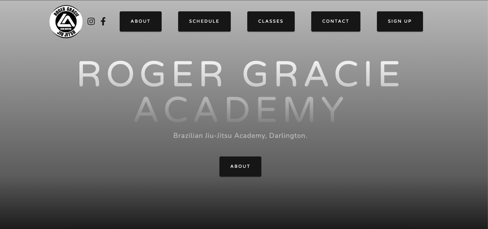

# RGAD

Roger Gracie Academy website based on Grayscale template by https://github.com/anubhavsrivastava/gatsby-starter-grayscale


Live version [here](https://www.rgadarlington.com/)

## Screenshot



## Install

Make sure that you have the Gatsby CLI program installed:

```sh
npm install --global gatsby-cli
```

And run from your CLI:

```sh
gatsby new <site-name> https://github.com/radbaniak/RGAD
```

Then you can run it by:

```sh
cd gatsby-example-site
npm install
gatsby develop
```
